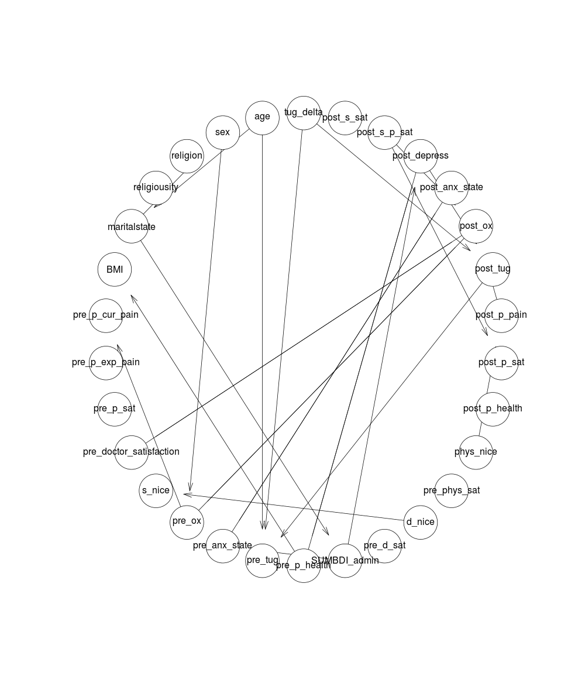
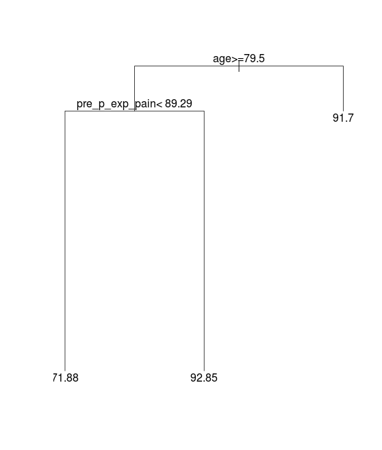
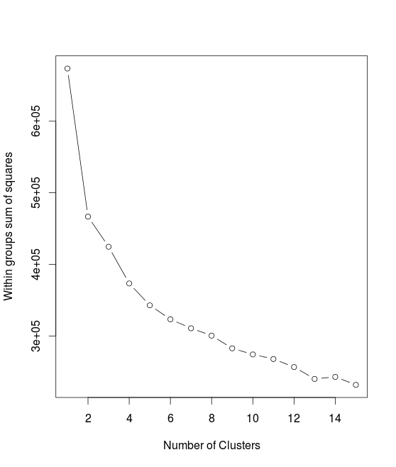
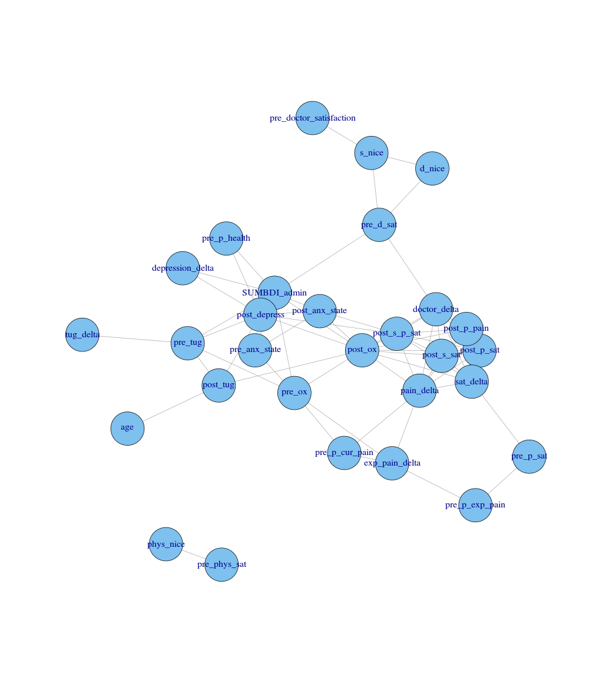

# Progress as of 2/4

## First steps

I first cleaned up the data (fun!), made the column names easier to understand, and exported the data to csv:

[Here is the file](ddr1.csv)

Did some initial correlation analysis.  Found some not terribly interesting things, like:

Post patient satisfaction and post predicted patient satisfaction (by the surgeon) are very closely correlated (.78).

Post patient pain and post patient satisfaction are very closely correlated (.58).

People who are more depressed going into surgery tend to be less satisfied with surgery (-.177).

Moved on to [bayesian networks](http://en.wikipedia.org/wiki/Bayesian_network).

Got a diagram that looks really interesting, but doesn't actually have a lot of useful information:

Arrows essentially indicate causation, but the causation could be through another variable.  Some conclusions from this:

Age is a cause of marital status (really?!)

The higher you are on the marital state (1=single, 2=married, 3=divorced, 4=widowed) scale, the more likely you are to be depressed (causal, somewhat obvious)

How well your surgeon thinks you are doing (post_s_p_sat) may cause how well you think you are doing (post_p_sat)

How well your doctor thinks you will do before the surgery (pre_d_sat) may have a causal relationship with how well you do after surgery (post_ox).  There is no similar relationship between pre_p_sat and post_ox, which means that the doctor may have some predictive capability that the patient does not.  pre_n_sat (how much the nurses think the patient will be satisfied) has a weaker relationship than the doctor does, so doctors may outpredict nurses (or affect the outcome more with their belief).

## Trees

At this point, I decided to try some [tree-based models](http://en.wikipedia.org/wiki/Decision_tree_learning) to see if anything interesting popped up.  Specifically, I created trees to see if any two variables could predict another variable well.  I did this for all the variables in the set.

One interesting thing:

You can predict how nice a doctor thinks a patient is pretty well using their age and pre_exp_pain (how much pain they expect).  Doctors think that patients who are older, or patients who expect to experience more pain, are less nice.

## Kmeans

I then moved on to doing [kmeans clustering](http://en.wikipedia.org/wiki/K-means_clustering) to see if there was anything interesting going on with groups of patients.

I wanted to see about how many distinct groups there are.  From plotting a within groups error plot, it looks like about 6-10 (reading these plots isn't really a science).  You don't want to overfit and have too many clusters, or underfit and have too few.  I am going to go with 7, just because.

Here are the clusters:

<TABLE border=1>
<TR> <TH>  </TH> <TH> age </TH> <TH> sex </TH> <TH> religion </TH> <TH> religiousity </TH> <TH> maritalstate </TH> <TH> BMI </TH> <TH> pre_p_cur_pain </TH> <TH> pre_p_exp_pain </TH> <TH> pre_p_sat </TH> <TH> pre_doctor_satisfaction </TH> <TH> s_nice </TH> <TH> pre_ox </TH> <TH> pre_anx_state </TH> <TH> pre_tug </TH> <TH> pre_p_health </TH> <TH> SUMBDI_admin </TH> <TH> pre_d_sat </TH> <TH> d_nice </TH> <TH> pre_phys_sat </TH> <TH> phys_nice </TH> <TH> post_p_health </TH> <TH> post_p_sat </TH> <TH> post_p_pain </TH> <TH> post_tug </TH> <TH> post_ox </TH> <TH> post_anx_state </TH> <TH> post_depress </TH> <TH> post_s_p_sat </TH> <TH> post_s_sat </TH> <TH> tug_delta </TH>  </TR>
  <TR> <TD align="right"> 1 </TD> <TD align="right"> 72.46 </TD> <TD align="right"> 1.38 </TD> <TD align="right"> 1.00 </TD> <TD align="right"> 2.15 </TD> <TD align="right"> 2.62 </TD> <TD align="right"> 29.54 </TD> <TD align="right"> 22.25 </TD> <TD align="right"> 94.52 </TD> <TD align="right"> 97.27 </TD> <TD align="right"> 90.69 </TD> <TD align="right"> 91.61 </TD> <TD align="right"> 12.23 </TD> <TD align="right"> 21.54 </TD> <TD align="right"> 21.30 </TD> <TD align="right"> 2.46 </TD> <TD align="right"> 12.77 </TD> <TD align="right"> 89.98 </TD> <TD align="right"> 93.67 </TD> <TD align="right"> 94.55 </TD> <TD align="right"> 97.18 </TD> <TD align="right"> 2.77 </TD> <TD align="right"> 9.01 </TD> <TD align="right"> 14.65 </TD> <TD align="right"> 16.86 </TD> <TD align="right"> 17.70 </TD> <TD align="right"> 21.92 </TD> <TD align="right"> 13.77 </TD> <TD align="right"> 39.04 </TD> <TD align="right"> 70.54 </TD> <TD align="right"> -5.89 </TD> </TR>
  <TR> <TD align="right"> 2 </TD> <TD align="right"> 69.50 </TD> <TD align="right"> 1.00 </TD> <TD align="right"> 1.00 </TD> <TD align="right"> 3.00 </TD> <TD align="right"> 2.00 </TD> <TD align="right"> 28.17 </TD> <TD align="right"> 6.51 </TD> <TD align="right"> 93.23 </TD> <TD align="right"> 95.31 </TD> <TD align="right"> 97.92 </TD> <TD align="right"> 98.44 </TD> <TD align="right"> 18.00 </TD> <TD align="right"> 21.00 </TD> <TD align="right"> 8.70 </TD> <TD align="right"> 3.00 </TD> <TD align="right"> 4.00 </TD> <TD align="right"> 90.62 </TD> <TD align="right"> 91.67 </TD> <TD align="right"> 45.31 </TD> <TD align="right"> 27.86 </TD> <TD align="right"> 2.50 </TD> <TD align="right"> 100.00 </TD> <TD align="right"> 100.00 </TD> <TD align="right"> 6.62 </TD> <TD align="right"> 35.50 </TD> <TD align="right"> 17.15 </TD> <TD align="right"> 4.50 </TD> <TD align="right"> 89.50 </TD> <TD align="right"> 82.00 </TD> <TD align="right"> -2.08 </TD> </TR>
  <TR> <TD align="right"> 3 </TD> <TD align="right"> 74.20 </TD> <TD align="right"> 1.37 </TD> <TD align="right"> 1.10 </TD> <TD align="right"> 2.17 </TD> <TD align="right"> 2.60 </TD> <TD align="right"> 28.58 </TD> <TD align="right"> 59.78 </TD> <TD align="right"> 95.94 </TD> <TD align="right"> 92.64 </TD> <TD align="right"> 95.52 </TD> <TD align="right"> 90.30 </TD> <TD align="right"> 27.82 </TD> <TD align="right"> 16.70 </TD> <TD align="right"> 13.88 </TD> <TD align="right"> 1.87 </TD> <TD align="right"> 5.77 </TD> <TD align="right"> 91.22 </TD> <TD align="right"> 92.78 </TD> <TD align="right"> 97.26 </TD> <TD align="right"> 98.39 </TD> <TD align="right"> 1.87 </TD> <TD align="right"> 91.32 </TD> <TD align="right"> 89.30 </TD> <TD align="right"> 8.47 </TD> <TD align="right"> 40.04 </TD> <TD align="right"> 15.94 </TD> <TD align="right"> 4.67 </TD> <TD align="right"> 95.52 </TD> <TD align="right"> 94.45 </TD> <TD align="right"> -5.32 </TD> </TR>
  <TR> <TD align="right"> 4 </TD> <TD align="right"> 72.10 </TD> <TD align="right"> 1.10 </TD> <TD align="right"> 1.00 </TD> <TD align="right"> 2.10 </TD> <TD align="right"> 2.65 </TD> <TD align="right"> 31.69 </TD> <TD align="right"> 17.76 </TD> <TD align="right"> 95.39 </TD> <TD align="right"> 93.63 </TD> <TD align="right"> 91.61 </TD> <TD align="right"> 95.04 </TD> <TD align="right"> 16.75 </TD> <TD align="right"> 20.55 </TD> <TD align="right"> 17.80 </TD> <TD align="right"> 2.00 </TD> <TD align="right"> 9.00 </TD> <TD align="right"> 89.53 </TD> <TD align="right"> 92.03 </TD> <TD align="right"> 96.28 </TD> <TD align="right"> 98.92 </TD> <TD align="right"> 2.40 </TD> <TD align="right"> 88.07 </TD> <TD align="right"> 49.32 </TD> <TD align="right"> 7.88 </TD> <TD align="right"> 30.57 </TD> <TD align="right"> 17.05 </TD> <TD align="right"> 5.15 </TD> <TD align="right"> 92.80 </TD> <TD align="right"> 98.45 </TD> <TD align="right"> -9.36 </TD> </TR>
  <TR> <TD align="right"> 5 </TD> <TD align="right"> 73.72 </TD> <TD align="right"> 1.22 </TD> <TD align="right"> 1.00 </TD> <TD align="right"> 2.33 </TD> <TD align="right"> 2.61 </TD> <TD align="right"> 29.40 </TD> <TD align="right"> 23.73 </TD> <TD align="right"> 86.61 </TD> <TD align="right"> 83.42 </TD> <TD align="right"> 67.40 </TD> <TD align="right"> 54.64 </TD> <TD align="right"> 18.60 </TD> <TD align="right"> 21.67 </TD> <TD align="right"> 16.39 </TD> <TD align="right"> 2.39 </TD> <TD align="right"> 10.11 </TD> <TD align="right"> 80.96 </TD> <TD align="right"> 82.23 </TD> <TD align="right"> 93.66 </TD> <TD align="right"> 95.54 </TD> <TD align="right"> 7.78 </TD> <TD align="right"> 83.48 </TD> <TD align="right"> 82.92 </TD> <TD align="right"> 11.33 </TD> <TD align="right"> 33.47 </TD> <TD align="right"> 19.44 </TD> <TD align="right"> 7.61 </TD> <TD align="right"> 89.59 </TD> <TD align="right"> 95.44 </TD> <TD align="right"> -4.77 </TD> </TR>
  <TR> <TD align="right"> 6 </TD> <TD align="right"> 71.19 </TD> <TD align="right"> 1.35 </TD> <TD align="right"> 1.04 </TD> <TD align="right"> 2.52 </TD> <TD align="right"> 2.50 </TD> <TD align="right"> 31.10 </TD> <TD align="right"> 18.13 </TD> <TD align="right"> 90.12 </TD> <TD align="right"> 92.24 </TD> <TD align="right"> 93.80 </TD> <TD align="right"> 93.59 </TD> <TD align="right"> 18.46 </TD> <TD align="right"> 20.38 </TD> <TD align="right"> 19.96 </TD> <TD align="right"> 2.23 </TD> <TD align="right"> 8.60 </TD> <TD align="right"> 91.95 </TD> <TD align="right"> 92.86 </TD> <TD align="right"> 96.69 </TD> <TD align="right"> 97.00 </TD> <TD align="right"> 2.08 </TD> <TD align="right"> 93.51 </TD> <TD align="right"> 90.47 </TD> <TD align="right"> 10.13 </TD> <TD align="right"> 38.57 </TD> <TD align="right"> 17.75 </TD> <TD align="right"> 5.35 </TD> <TD align="right"> 96.44 </TD> <TD align="right"> 99.11 </TD> <TD align="right"> -9.55 </TD> </TR>
  <TR> <TD align="right"> 7 </TD> <TD align="right"> 72.96 </TD> <TD align="right"> 1.31 </TD> <TD align="right"> 1.00 </TD> <TD align="right"> 2.38 </TD> <TD align="right"> 2.54 </TD> <TD align="right"> 29.10 </TD> <TD align="right"> 25.92 </TD> <TD align="right"> 93.03 </TD> <TD align="right"> 92.73 </TD> <TD align="right"> 90.53 </TD> <TD align="right"> 89.13 </TD> <TD align="right"> 17.20 </TD> <TD align="right"> 22.04 </TD> <TD align="right"> 20.41 </TD> <TD align="right"> 2.46 </TD> <TD align="right"> 11.12 </TD> <TD align="right"> 87.14 </TD> <TD align="right"> 89.26 </TD> <TD align="right"> 95.83 </TD> <TD align="right"> 96.86 </TD> <TD align="right"> 2.50 </TD> <TD align="right"> 45.95 </TD> <TD align="right"> 51.56 </TD> <TD align="right"> 11.13 </TD> <TD align="right"> 27.91 </TD> <TD align="right"> 21.73 </TD> <TD align="right"> 7.50 </TD> <TD align="right"> 69.85 </TD> <TD align="right"> 92.00 </TD> <TD align="right"> -9.34 </TD> </TR>
   </TABLE>
   
One thing that immediately jumps out is just how much people expect surgery to change their pain.  Even the really low pain group (3) expects to go from a 59 to a 95 on the pain scale (higher is lower pain).

Let's look at this trend in the aggreggate.  Across all patients, the current pain is rated at a 28 (pretty severe), and they expect that pain to go to 92 after surgery.  However, after surgery, the mean pain is 76.  Patients have an exaggerated belief in the power of surgery to heal their pain.  There is no correlation between a patients expectation for surgery to reduce their pain (pre_p_exp_pain) and what actually happens (post_p_pain).  There is a significant difference in post_depress (depression after surgery) between patients who had high initial expectations and experienced high pain after surgery versus those who had neither.  There is no significant link between depression going into surgery, which indicates that dashed expectations of surgery to reduce pain may cause depression among patients.

Going back to the concept of the "pain delta" (people who expect their pain to be reduced more by surgery), there is a postive correlation between religiousity (how devout you are) and the amount you believe your pain will be reduced.  This correlation is significantly weaker when applied to actual pain reduction, which indicates that more religious people are more likely to overstate how much surgery will reduce their pain.

So anyways, long but interesting digression, now back to the clusters:

Cluster 1 is really interesting.  It consists of people who went into surgery feeling a good amount of pain (22), but with a strong belief that they would get better (90), and with doctors thinking the same.  They unfortunately weren't extremely functional (12 on ox test and 21 on tug), and rated their health okay (2.7).  They were also fairly depressed (12 on depression scale).  After surgery, they rate their health as slightly better than when they went in (2.77), but are extremely unsatisfied with it (9/100!), and experience a lot of pain (14).  Their tug times reduce (to 16), but not by much.  Their ox test also gets a bit better (to 17).  Their depression increases (to 14), and their doctor does not think they are very satisfied (39), but the doctor is still pretty satisfied with his/her performance (70).

Cluster 2 would be interesting, but only has 2 members.

Cluster 3 is people who weren't feeling a lot of pain to begin with, but rated their health very low.  They seem to have recovered well (except for their health rating).

Cluster 4 is people whose expectations were dashed in regards to pain reduction, but who are surprisingly okay with it.  They expected their pain to go from 17 to 95, and it only went to 49 post surgery.  Yet they are significantly less depressed post-surgery (9 vs 5), and their tug times improve significantly (-10).  They also rate their health a little better (2 vs 2.4).

Nothing super exciting about the remaning clusters.

## Correlation network

The next step was to make a nice chart of correlations to make it easier to pick them out.

"Soft" measures such as pain are a better predictor of post patient satisfaction than "hard" indicators like tug delta.  "Soft" measures like pain are almost as good at predicting things like tug_delta as hard measures like pre_ox, post_tug, and age are.

Doctors who think their patients are nice tend to think they will recover better (pre_d_sat and s_nice).  Doctors think that more anxious patients are less nice.  (s_nice and pre_anx_state/pre_anx_trait).  Doctors think that nicer patients will be more satisfied (d_nice, pre_d_sat). (.63)  Correlation is .43 for physiologists (phys_nice and pre_phys_nice), and .812 for nurses (pre_n_dat, n_nice).  Niceness measurements of doctor, nurse, and physiologist only weakly correlated. (.25 for doctor/nurse, .09 for phys/nurse, .08 for doctor/phys).

Nurses are much better than doctors at predicting patient satisfaction before the surgery (pre_d_sat/post_p_sat -> .03, pre_n_sat/post_p_sat -> .15), and much better than patients (pre_p_sat/post_p_sat -> .02).

How nice the doctor thinks the patient is (s_nice and d_nice) correlates somewhat with how satisfied the surgeon is with the surgery (post_s_sat) (.13 and .1).

Doctors think depressed patients will do much worse than they actually end up doing(sumbdi_admin, pre_d_sat, post_p_sat) (-.32 vs -.14).  More depressed patients have a higher tug (.34 correlation between sumbdi_admin and pre_tug).

## Next steps

It would be good to get your thoughts on how to proceed.  There are some interesting things in the data set, but we are close to the limit of what can be done with it here.
